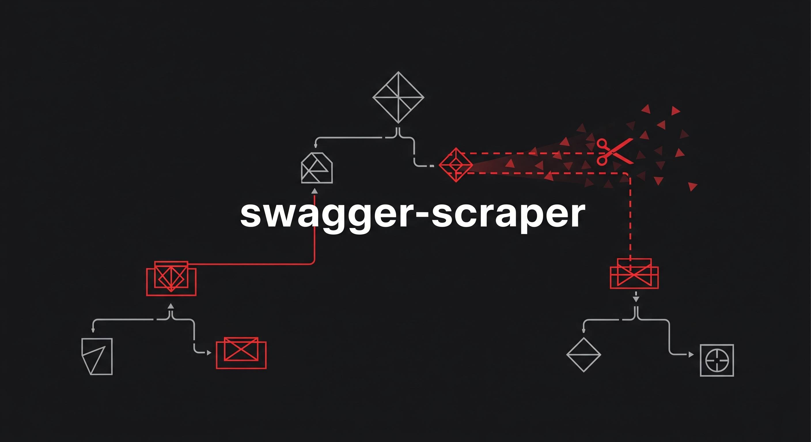

# swagger-scraper [](https://github.com/segurvita/swagger-scraper/actions/workflows/ci.yml)

<div style="text-align:right">Language: <i>English</i> | <a href="README_JA.md">日本語</a></div>



This module minify your swagger file.

# Purpose

The purpose of this module is to avoid capacity limit errors that occur when importing a swagger file into Amazon API Gateway.

# Usage

This module require npm. If npm has already been installed, you can install the library with the following command.

```bash
npm install swagger-scraper
```

Please call the module as following.

```javascript
// import package
const fs = require("fs");
const scraper = require("swagger-scraper");

// read yaml file
const inputSwagger = fs.readFileSync("./swagger.yaml", "utf8");

// delete example and empty description and delete parent of deprecated
const outputSwagger = scraper(inputSwagger)
  .deleteTarget("example")
  .emptyTarget("description")
  .deleteParent("deprecated")
  .toString();

// display result
console.log(outputSwagger);
```

# API

### scraper(inputSwagger)

Parses `inputSwagger` as YAML format. Please call this function first, and then connect method chains below.

### deleteTarget(scrapTarget)

Delete the item whose key is `scrapTarget`. It can be used for method chain.

### emptyTarget(scrapTarget)

Replace the value of `scrapTarget` with `''` . It can be used for method chain.

### deleteParent(scrapTarget)

Delete the element whose child has `scrapTarget`. It can be used for method chain.

### deleteDeprecatedMethod()

This API removes the `deprecated` method element. In addition, if there is a path element that does not have a method element, it is also deleted. It can be used for method chain.

### toString()

Generate a YAML format string based on the current data and return it.

# Development

If you edit this project, you can clone it from the repository and build the development environment with the following command.

```bash
# Install required packages
npm install

# Run the test
npm test
```
